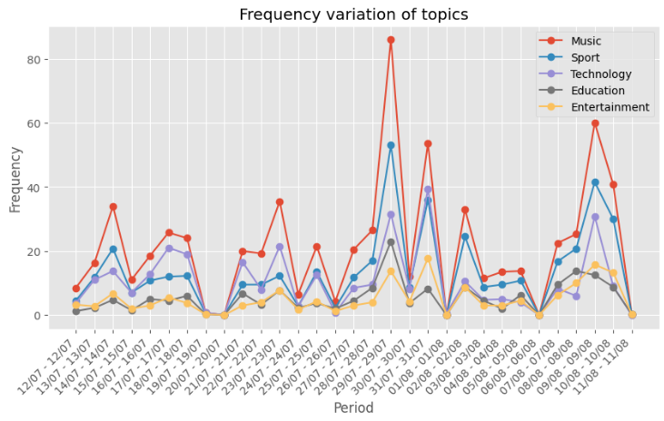

# YouTube History Analysis

Understand the YouTube content you are watching.

<p align="center">
  
  
</p>
<p align="center">
    
  
</p>

## Installation

### Clone the repository

```bash
git clone https://github.com/mattiaferrarini/YouTube-History-Analysis.git
```

### Install the required libraries

```bash
pip install -r requirements.txt
```

### YouTube Data API key

Create a project in the [Google Developers Console](https://console.developers.google.com/) and [obtain an API key](https://developers.google.com/youtube/registering_an_application). Create a file named `.env` in the project folder and add the created key to it as follows:

```
YOUTUBE_API_KEY=your-key
```

### YouTube history

You can download your YouTube history from [Google Takeout](https://takeout.google.com/settings/takeout). 

Click `Deselect all` at the top of the export panel. Then scroll all the way down to `YouTube and YouTube Music`. You should check the box, then only include `history` in the export and choose `JSON` as the format.

Once you have downloaded your history, add it to the project folder and rename it to `watch-history.json` if necessary.


## Usage

### Virtual environment

You should create an isolated virtual Python environment for the project using [virtualenv](https://virtualenv.pypa.io/en/latest/) to avoid problems with dependencies and versions.

Install virtualenv:

```bash
pip3 install virtualenv
```

Create a virtual environment:

```bash
virtualenv <your-env>
```

Activate it:
```bash
source <your-env>/bin/activate
```

To deactivate it afterwards:
```bash
deactivate
```

### Process your history

Run the `history_processor.py` script:

```bash
python history_processor.py
```

The script will process the `watch-history.json` file, filtering out ads and useless data. It also queries the YouTube Data API in order to get the topics and tags of your watched videos. The final output is a `processed-history.json` file. 

#### API quota limits

Since the YouTube Data API has a default quota allocation of 10,000 units per day, you may need to run the script on multiple days to process the entire history.

To manage this, `history_processor.py` generates a `last-processed-history.json` file which stores the index of the last processed history item. If this file exists when the script is run again, processing will resume from where it left off in the previous session.

### Analyse your history

Once you have a `processed-history.json` file, you can analyse it by running the `analysis.ipynb` notebook.
